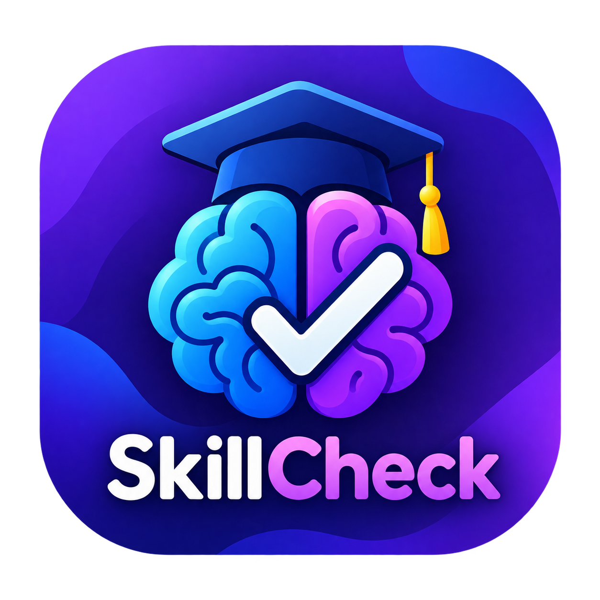

# 🎯 SkillCheck

<p align="center">
  
</p>

<p align="center">
  <strong>Test • Learn • Grow 🚀</strong>
</p>

<p align="center">
  A complete Flutter-based skill assessment and quiz application with local SQLite database, BLoC state management, progress tracking, and quiz history.
</p>

<p align="center">
  
  
  
  
  
</p>

---

## 📱 About

**SkillCheck** is a complete mobile application developed with **Flutter** during my **Flutter Development Internship at Owasoft Technologies Pvt Ltd**.

The application allows users to provide their personal information, explore different skill categories, select specific skills, attempt multiple-choice quizzes, receive scores, track their overall progress, and view their completed quiz history.

The application uses a **local SQLite database** for persistent storage. Personal information and quiz results remain stored on the device without requiring a backend server, Firebase, or cloud database.

---

## ✨ Features

* 👤 **Personal Information**

    * Name
    * Education
    * Profession
    * Form validation
    * Local persistence using SQLite

* 📚 **Skill Categories**

    * Programming Skills
    * Computer Skills
    * Digital & Cybersecurity Skills
    * Problem Solving Skills

* 🧩 **Skill-Based Quizzes**

    * Multiple-choice questions
    * Option selection
    * Question navigation
    * Quiz completion handling

* 🎯 **Scoring System**

    * ✅ Correct answer: **+2 marks**
    * ❌ Wrong answer: **−2 marks**

* 🏆 **Quiz Results**

    * Final marks
    * Pass/Fail evaluation
    * Completed quiz information

* 📊 **Progress Tracking**

    * Total quizzes completed
    * Overall score percentage
    * Visual progress indicator

* 🗂️ **Quiz History**

    * Quiz number
    * Skill name
    * Category name
    * Marks obtained
    * Pass/Fail result

* 💾 **Local SQLite Database**

    * Persistent profile information
    * Persistent quiz results
    * No backend required

* 🚀 **Smart Splash Screen**

    * Checks whether the user already exists in the local database
    * Existing user → Home Screen
    * New user → Personal Information Screen

* 🎨 **Modern Mobile UI**

    * Custom application branding
    * App launcher icon
    * Clean Material UI
    * Responsive layouts

---

## 🧠 Skill Categories

### 💻 Programming Skills

* Programming Fundamentals
* Object-Oriented Programming
* Data Structures & Algorithms

### 🖥️ Computer Skills

* Computer Fundamentals
* Operating Systems
* Internet & Web Basics

### 🛡️ Digital & Cybersecurity Skills

* Cybersecurity Basics
* Online Safety
* Password & Privacy Awareness

### 🧠 Problem Solving Skills

* Logical Reasoning
* Analytical Thinking
* Problem Solving

---

## 🏗️ Architecture

SkillCheck follows a **feature-based architecture** and uses **BLoC** for state management.

```text
Flutter UI
    │
    ▼
BLoC
Events / States
    │
    ▼
DatabaseHelper
    │
    ▼
SQLite Local Database
```

### 📂 Project Structure

```text
lib/
├── core/
│   ├── database/
│   │   └── database_helper.dart
│   └── widgets/
│
├── features/
│   ├── home/
│   ├── personal_information/
│   ├── profile/
│   ├── quiz/
│   ├── skill_category/
│   └── splash/
│
└── main.dart
```

---

## 💾 Local Database

SkillCheck uses **SQLite** through the `sqflite` package to store application data locally.

### 👤 Profile Data

* Name
* Education
* Profession

### 📝 Quiz Data

* Quiz Number
* Category Name
* Skill Name
* Marks
* Pass/Fail Status

All profile information and completed quiz results are persisted locally on the device.

---

## 🔄 Application Flow

```text
🚀 Splash Screen
       │
       ▼
Check Local SQLite Database
       │
   ┌───┴────┐
   │        │
Exists   New User
   │        │
   ▼        ▼
🏠 Home   👤 Personal Information
   │        │
   └───┬────┘
       ▼
📚 Skill Category
       │
       ▼
🧩 Select Skill
       │
       ▼
📝 Quiz
       │
       ▼
🏆 Quiz Results
       │
       ▼
💾 Save Results to SQLite
       │
   ┌───┴────┐
   ▼        ▼
🏠 Home   👤 Profile
   │        │
📊 Progress 🗂️ Quiz History
```

---

## 📱 Main Screens

| Screen                  | Description                                    |
| ----------------------- | ---------------------------------------------- |
| 🚀 Splash Screen        | Checks local user information                  |
| 👤 Personal Information | Collects and stores user details               |
| 🏠 Home Screen          | Displays dashboard and progress                |
| 📚 Skill Category       | Displays available skill categories            |
| 📝 Quiz Screen          | Allows users to attempt quizzes                |
| 🏆 Quiz End Screen      | Displays quiz results                          |
| 👤 Profile Screen       | Displays personal information and quiz history |

---

## 🛠️ Technologies

| Technology                 | Purpose                        |
| -------------------------- | ------------------------------ |
| 🐦 Flutter                 | Mobile application development |
| 🎯 Dart                    | Programming language           |
| 🔄 BLoC                    | State management               |
| 💾 SQLite / sqflite        | Local database                 |
| 🧭 Flutter Navigation      | Screen navigation              |
| 🎨 Material UI             | User interface                 |
| 🖼️ Flutter Launcher Icons | App launcher icon              |
| 📱 Android                 | Target mobile platform         |

---

## 📦 Main Packages

* `flutter_bloc`
* `bloc`
* `sqflite`
* `path`
* `flutter_launcher_icons`

---

## 🚀 Getting Started

### Prerequisites

* Flutter SDK
* Dart SDK
* Android Studio
* Android Emulator or Android Device
* Git

### Clone the Repository

```bash
git clone https://github.com/abdulsamad010/skillcheck_flutter
```

### Navigate to the Project

```bash
cd skillcheck_flutter
```

### Install Dependencies

```bash
flutter pub get
```

### Run the Application

```bash
flutter run
```

---

## 📦 Build Release APK

Generate a release APK for testing:

```bash
flutter build apk --release
```

The generated APK will be available at:

```text
build/app/outputs/flutter-apk/app-release.apk
```

---

## 🎓 Internship Project

This application was developed as part of my **Flutter Development Internship at Owasoft Technologies Pvt Ltd**.

Through this project, I gained practical experience in:

* Flutter application development
* Dart programming
* BLoC state management
* Feature-based architecture
* SQLite database integration
* CRUD operations
* Local data persistence
* Form validation
* Navigation and routing
* Quiz logic and scoring
* Progress calculation
* Responsive UI development
* Android release builds
* Application launcher icon configuration

---

## 👨‍💻 Developer

**Abdul Samad**

Flutter Developer • Mobile Application Development

---

## 🏢 Organization

**Owasoft Technologies Pvt Ltd**

---

## 📄 License

This project was developed for educational and internship purposes.

---

<p align="center">
  <strong>🎯 SkillCheck — Test Your Knowledge. Challenge Yourself. Keep Improving. 🚀</strong>
</p>

<p align="center">
  Made with ❤️ using Flutter & Dart
</p>

````
